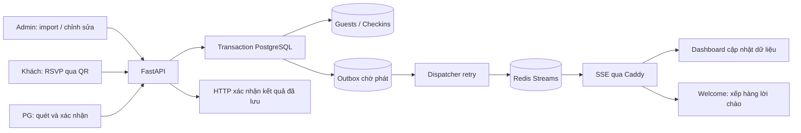
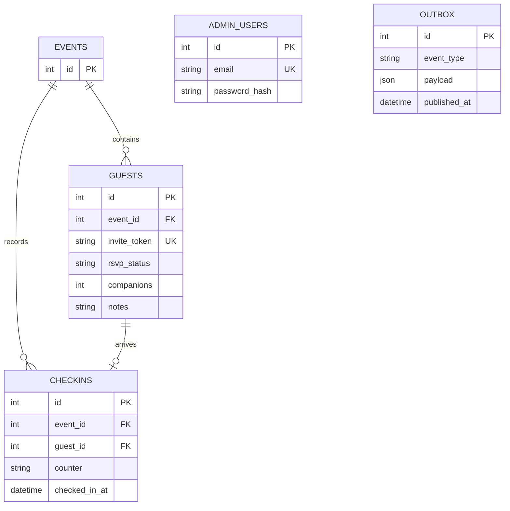

# Báo cáo hệ thống Thiên Long Event Check-in

## 1. Phạm vi và quyết định triển khai

Repo phục vụ một sự kiện khoảng 350 khách, gồm đủ bảy hạng mục: RSVP, PG check-in, dashboard BTC, quản lý khách, tạo QR, welcome screen và xuất báo cáo. Một frontend Next.js dùng bốn nhóm route, một backend FastAPI và một PostgreSQL.

**Yêu cầu bổ sung Redis + SSE được ưu tiên hơn cơ chế polling trong blueprint gốc.** API ghi dữ liệu nghiệp vụ và bản ghi chờ phát trong một transaction; sau commit, dispatcher chuyển thông báo qua Redis Streams và SSE tới trình duyệt. Luồng này cho phép giao diện cập nhật ngay khi nhận sự kiện và tránh báo check-in thành công khi database chưa lưu được.

| Thành phần | Công nghệ / vai trò |
|---|---|
| Web | Next.js App Router, TypeScript, React |
| UI | Tailwind CSS, shadcn/ui với Radix primitives, Lucide |
| Bảng / form | TanStack Table, React Hook Form, Zod |
| Camera | QR scanner chạy trong browser, sử dụng camera sau khi cấp quyền |
| API | FastAPI, Pydantic, SQLAlchemy |
| DB / migration | PostgreSQL 17, Alembic |
| Auth | JWT phân vai Admin/PG, mật khẩu và mã PG được hash |
| Realtime | Redis Streams, SSE một chiều server → browser |
| Hạ tầng | Vercel frontend; Docker trên VNPT Cloud; Caddy `minute_caddy` hiện có |

Phiên bản dependency thực tế được khóa trong `apps/web/package-lock.json` và requirements của API. Không cần native app hoặc tài khoản riêng cho từng PG.

## 2. Sơ đồ dataflow



Tất cả kết nối API/SSE từ trình duyệt đi qua HTTPS tới cloud; Vercel phục vụ web. Browser không biết mật khẩu DB/Redis và không kết nối trực tiếp Redis.

### Luồng import và QR

1. BTC tải file CSV/XLSX, chọn xem trước; nếu chỉ bổ sung một người thì dùng **Khách mời → Thêm khách**.
2. API kiểm tra header, dòng dữ liệu và thông tin không hợp lệ, trả lỗi theo dòng; chưa ghi dữ liệu.
3. BTC sửa lỗi rồi xác nhận import. API kiểm tra lại file, ghi transaction, sinh token ngẫu nhiên cho từng khách.
4. BTC tải ZIP gồm PNG QR và mapping CSV, đối soát trước khi in thiệp.
5. QR chứa duy nhất URL `/i/{invite_token}`; không chứa tên, email, phone hoặc ID database.

Email trùng trong phạm vi sự kiện được bỏ qua để hạn chế nhập lặp. Hai người cùng tên vẫn có thể là hai khách khác nhau. Với dữ liệu không có email, cần đối soát file nguồn trước khi import lại; không dùng tên làm khóa định danh.

### CSV demo tự đồng bộ khi deploy

Repo bàn giao sẵn [`apps/api/data/demo-guests.csv`](../apps/api/data/demo-guests.csv) với đúng ba khách: **Diệp Gia Luật, Ánh Hiếu, Đặng Như Phước**. Docker image chứa file này; trước khi Uvicorn phục vụ request, Compose tự chạy migration rồi `python -m app.seed --guests-file data/demo-guests.csv`.

Lần đầu, mỗi dòng CSV tạo một khách ở trạng thái `pending` và tự nhận token riêng. Các lần sau khớp bằng email duy nhất để cập nhật thông tin nhưng giữ nguyên token, RSVP và check-in. Khách tạo thêm qua UI/API không bị xóa. Muốn bổ sung khách tự động, thêm dòng có email mới vào CSV rồi build/deploy lại backend. Local có thể dùng `--replace-guests` để xóa dữ liệu thử và nạp lại đúng ba người; production cố ý chặn tùy chọn xóa này.

### Luồng RSVP

```mermaid
sequenceDiagram
    participant Guest as Khách
    participant API as FastAPI
    participant DB as PostgreSQL
    participant Redis as Redis/SSE
    participant Admin as Dashboard Admin
    Guest->>API: GET invitation theo token
    API-->>Guest: Tên, sự kiện, RSVP, giới hạn người đi cùng
    Guest->>API: PUT RSVP accepted/declined + companions
    API->>DB: Khóa khách, validate và lưu RSVP + outbox
    DB-->>API: Commit
    API-->>Guest: Xác nhận đã lưu
    API->>Redis: Dispatcher phát rsvp
    Redis-->>Admin: SSE rsvp; tải snapshot mới
```

Khách không đăng nhập. Từ chối tham dự tương ứng `companions = 0`; số người đi cùng phải là số nguyên trong giới hạn cấu hình. RSVP sau khi đã check-in bị chặn để giữ thống kê nhất quán.

### Luồng check-in

1. PG nhập mã chung và chọn quầy. API xác thực rồi cấp JWT tạm thời gắn với sự kiện và quầy.
2. Camera đọc QR, frontend lấy token từ đường dẫn `/i/...` và gọi API xem tên/đơn vị.
3. PG kiểm tra đúng người rồi bấm xác nhận. Việc đọc QR chưa tự check-in.
4. API kiểm tra quyền, sự kiện và quầy; ghi check-in cùng outbox.
5. PostgreSQL có `UNIQUE(event_id, guest_id)`: hai PG cùng thao tác chỉ một bản ghi hợp lệ. Request trùng trả HTTP 409, giữ giờ/quầy đầu tiên.
6. Sau commit, API trả thành công; Redis/SSE chuyển thông báo đến dashboard và welcome.

Tìm tên thủ công dùng cùng API check-in và cùng ràng buộc database. Khách chưa RSVP hoặc đã từ chối vẫn có thể đến tại sự kiện; PG đối chiếu trạng thái trước xác nhận, hệ thống không tự sửa RSVP thành accepted.

## 3. Realtime hoạt động thế nào?

**Redis Streams** lưu một chuỗi event có ID tăng dần. Backend đọc bằng `XREAD` chờ dữ liệu; mỗi kết nối SSE giữ cursor riêng để tất cả màn hình nhận cùng event. Không dùng consumer group chia việc giữa các màn hình, vì mỗi màn hình cần nhận đủ sự kiện. [Redis XREAD](https://redis.io/docs/latest/commands/xread/).

SSE là HTTP connection mở lâu, response `text/event-stream`:

```text
id: 1789195810000-0
event: checkin
data: {"id":42,"name":"Nguyễn Văn A","company":"Công ty ABC","checked_in_at":"2026-09-12T11:30:10Z"}

```

`id` phía ngoài dùng nối lại luồng; `data.id` là định danh check-in để bỏ qua event trùng. Khi dispatcher đã gửi Redis nhưng chưa kịp đánh dấu đã phát rồi bị restart, thông báo có thể phát lại. Bảo đảm là **at-least-once**, không tuyên bố exactly-once; frontend xử lý trùng.

- Kết nối mới nhận `ready`, lấy snapshot từ API để có trạng thái hiện tại.
- Admin dùng `fetch()` streaming với Bearer header. JWT không nằm trong query URL.
- Các event `checkin`, `rsvp`, `guests_changed` làm mới dữ liệu cần thiết; không có timer polling dashboard/welcome trong vận hành bình thường.
- Heartbeat giữ luồng sống; đứt mạng thì reconnect có backoff, gửi `Last-Event-ID` để đọc tiếp khi Redis còn lịch sử.
- Welcome chỉ nhận tên, đơn vị, giờ và ID check-in; không nhận thông tin liên hệ. Mỗi khách hiện 7 giây, các khách đến gần nhau được xếp hàng.
- Redis gián đoạn: check-in vẫn được ghi PostgreSQL; outbox chờ phát và retry. Giao diện báo mất kết nối, cập nhật lại sau khi nối được.
- DB lỗi: API không trả check-in thành công, không phát sự kiện nghiệp vụ chưa commit.
- Redis chỉ giữ lịch sử có giới hạn. Sau khi mất toàn bộ Redis/restore DB, cần tải lại snapshot; không xem stream là bản lưu trữ khách mời.

## 4. Mô hình dữ liệu và tính đúng đắn



Hình trên biểu diễn quan hệ logic; tên field chính xác xem models/migration. Backend dùng thời gian có timezone; giao diện và báo cáo hiển thị theo `Asia/Ho_Chi_Minh`. Invitation token có entropy cao, không suy ra từ tên hay email.

### Sinh token và nối token với khách

Mỗi hàng trong bảng `guests` có đúng một `invite_token`. Đây là quan hệ trực tiếp trên cùng bản ghi, không cần bảng nối:

```text
Admin thêm khách / xác nhận import
        ↓
Backend tạo secrets.token_urlsafe(32)
        ↓  32 byte ngẫu nhiên = 256 bit, chuỗi Base64URL 43 ký tự
INSERT guests (..., invite_token, ...)
        ↓
UNIQUE INDEX kiểm tra không trùng trên PostgreSQL
        ↓
invitation_url = PUBLIC_FRONTEND_URL + /i/ + invite_token
        ↓
QR PNG được dựng từ invitation_url khi tải
```

Token được sinh ở backend bằng bộ sinh số ngẫu nhiên mật mã của hệ điều hành. SQLAlchemy đặt hàm sinh token làm giá trị mặc định lúc `INSERT`, nên mọi luồng tạo `Guest` đều nhận token: import CSV/XLSX, nút **Thêm khách**, CSV đồng bộ lúc deploy và dữ liệu demo local. Client không có field `invite_token`; cố gửi token tự chọn bị HTTP 422. PostgreSQL còn có unique index để bảo vệ lớp cuối, dù xác suất hai token 256-bit trùng nhau gần như bằng không.

Backend lưu token trên chính khách để tìm đúng lời mời bằng phép so khớp chính xác. Khi mở `/i/{token}`, API chỉ trả tên, đơn vị và dữ liệu RSVP tối thiểu. Admin mới được đọc URL đầy đủ và tải QR. Token không nằm trong log request. QR không được lưu thành blob: hệ thống tạo lại từ `PUBLIC_FRONTEND_URL` và token đã lưu, nên QR đơn lẻ hay ZIP luôn trỏ tới cùng khách.

Cách tạo thêm khi phát sinh khách:

1. Một khách: vào `/admin/guests` → **Thêm khách** → nhập thông tin → lưu. API `POST /admin/guests` tạo bản ghi, token, URL và QR trong cùng thao tác; khách mới xuất hiện realtime trên dashboard/danh sách.
2. Nhiều khách: vào `/admin/import`, tải template, preview rồi xác nhận. Mỗi dòng mới nhận một token riêng. Email trùng được giữ ở khách cũ và không thay token; hai khách trùng tên vẫn được phép.
3. Tích hợp hệ thống khác: gọi `POST /api/v1/admin/guests` bằng Admin Bearer JWT; lấy `invitation_url` từ HTTP 201. Không sinh token ở frontend và không sửa trực tiếp database.

```http
POST /api/v1/admin/guests
Authorization: Bearer ADMIN_JWT
Content-Type: application/json

{"name":"Nguyễn Văn Mới","company":"Đối tác A","email":"moi@example.com","phone":"0900000000"}
```

Response HTTP 201 trả object `Guest`, trong đó `invite_token` và `invitation_url` đã được gắn với khách vừa tạo. Admin có thể tải ngay `/admin/guests/{id}/qr.png`; khách dùng `invitation_url` cho cả RSVP và check-in.

Một khách không cần nhiều token song song. Sửa tên/email/RSVP giữ nguyên token để QR đã in tiếp tục hoạt động. V1 không cung cấp rotate token vì thao tác đó lập tức làm hỏng link/QR cũ; khi link bị lộ, BTC cần xử lý có kiểm soát trước khi phát QR thay thế.

### Định nghĩa KPI

| Chỉ số | Công thức |
|---|---|
| Tổng khách mời | Số bản ghi guest / số lời mời |
| Đã xác nhận / Từ chối / Chưa phản hồi | Đếm theo trạng thái RSVP |
| Dự kiến tham dự | Tổng `1 + companions` của khách accepted |
| Đã check-in | Số **lời mời** có bản ghi check-in |
| Chưa đến | Tổng lời mời trừ số lời mời đã check-in |
| No-show | Khách accepted nhưng chưa có check-in |
| Tỷ lệ check-in | Số lời mời đã check-in / tổng lời mời × 100 |
| Số người đăng ký của khách đã đến | Tổng `1 + companions` của các lời mời đã check-in; chỉ là ước tính |

Không chia số lời mời đã check-in cho tổng người đăng ký để tính tỷ lệ. Schema v1 không ghi riêng số người đi cùng thực sự qua cửa, nên không khẳng định con số ước tính là tổng người hiện diện thực tế. Muốn đếm headcount thực cần bổ sung thao tác PG ghi số người đi cùng đã đến.

## 5. API và quyền truy cập

Base URL: `https://YOUR_API_DOMAIN/api/v1`. JSON snake_case, lỗi validation HTTP 422, không có quyền 401/403, không tìm thấy 404, xung đột 409, quá giới hạn 429. Lỗi thường có `detail`; duplicate check-in trả trực tiếp object có `status: already_checked_in`.

| Quyền | API | Dùng để |
|---|---|---|
| Public | `GET /public/event` | Tên, địa điểm, giờ, danh sách quầy |
| Invite token | `GET /public/invitations/{token}` | Lấy lời mời tối thiểu |
| Invite token | `PUT /public/invitations/{token}/rsvp` | RSVP |
| Mã PG | `POST /pg/session` | Đăng nhập quầy |
| PG JWT | `GET /pg/guests/search?q=...` | Tìm tên, tối thiểu 2 ký tự |
| PG JWT | `GET /pg/guests/by-token/{token}` | Đọc thông tin check-in |
| PG JWT | `POST /pg/checkins` | Check-in camera hoặc thủ công |
| Public login | `POST /admin/login` | Đăng nhập BTC |
| Admin JWT | `GET /admin/me`, `GET /admin/event` | Tài khoản, cấu hình và link welcome |
| Admin JWT | `GET /admin/guests` | Tìm, lọc, sắp xếp, phân trang |
| Admin JWT | `POST /admin/guests` | Thêm một khách, tự sinh token/URL/QR |
| Admin JWT | `GET/PATCH /admin/guests/{id}` | Xem/sửa khách |
| Admin JWT | `POST /admin/guests/import/preview` | Kiểm tra CSV/XLSX |
| Admin JWT | `POST /admin/guests/import` | Nhập file đã kiểm tra lại |
| Admin JWT | `GET /admin/guests/template.csv` | File mẫu |
| Admin JWT | `GET /admin/guests/qr.zip` | Toàn bộ QR và mapping |
| Admin JWT | `GET /admin/guests/{id}/qr.png` | QR một khách |
| Admin JWT | `GET /admin/dashboard/summary` | KPI, quầy, check-in mới |
| Admin JWT | `GET /admin/dashboard/checkins` | Lượt đến theo thời gian |
| Admin JWT | `GET /admin/export/checkins.xlsx` hoặc `.csv` | Báo cáo toàn bộ khách |
| Admin JWT | `GET /admin/stream` | SSE thông báo thay đổi |
| Screen token | `GET /public/welcome/{token}` | Snapshot welcome |
| Screen token | `GET /public/welcome/{token}/stream` | SSE lời chào |
| Health | `GET /health`, `GET /health/ready` | Tiến trình và phụ thuộc, ngoài prefix `/api/v1` |

Request/response đầy đủ nằm trong [API_CONTRACT.md](API_CONTRACT.md) và schema OpenAPI của backend; `/docs` phục vụ tra cứu khi được bật ở môi trường phù hợp.

Ví dụ RSVP:

```http
PUT /api/v1/public/invitations/INVITE_TOKEN/rsvp
Content-Type: application/json

{"status":"accepted","companions":1}
```

Ví dụ PG:

```http
POST /api/v1/pg/session
Content-Type: application/json

{"access_code":"YOUR_EVENT_CODE","counter":"COUNTER_01"}
```

Lấy `access_token` từ response rồi:

```http
POST /api/v1/pg/checkins
Authorization: Bearer PG_ACCESS_TOKEN
Content-Type: application/json

{"guest_token":"INVITE_TOKEN","counter":"COUNTER_01"}
```

Không đặt secret vào script đã commit. Token PG bị ràng buộc quầy, đổi `counter` trong request không chuyển quyền sang quầy khác. Admin và PG JWT không dùng thay cho nhau.

GET danh sách hỗ trợ `search`, `rsvp_status`, `checkin_status`, `page`, `page_size`, `sort`. Ví dụ `?rsvp_status=accepted&checkin_status=not_checked_in&page=1&page_size=20&sort=name`.

Import gửi `multipart/form-data`, field `file`; không tự đặt header JSON. File tối thiểu:

```csv
name,company,email,phone,notes
Nguyễn Văn A,Công ty ABC,guest-a@example.com,0900000001,Khách VIP
Trần Thị B,Công ty XYZ,,,
```

Chỉ `name` bắt buộc có giá trị; email/phone có thể trống. Báo cáo CSV/XLSX chứa cả người chưa đến để đối soát no-show, thời gian và quầy được giữ từ check-in gốc. Chuỗi nguy hiểm kiểu công thức được xử lý khi xuất spreadsheet.

### Giao diện và hai danh sách khách

Giao diện dùng trực tiếp logo `thienlong-logo.png`, nền trắng là màu chủ đạo, xanh Thiên Long cho điều hướng/nút chính và đỏ cho điểm nhấn. Card, dialog, nút và bảng có phân lớp shadow, trạng thái hover/focus và hiệu ứng vào trang ngắn; chuyển động tự tắt khi thiết bị bật `prefers-reduced-motion`. Dashboard rút gọn nội dung, tăng cỡ và độ tương phản của KPI, tiến độ, biểu đồ và bảng check-in gần nhất.

Trang **Khách mời** có hai tab cùng dùng dữ liệu PostgreSQL:

- **Thư mời**: toàn bộ khách đã nhập/tạo, thông tin liên hệ, phản hồi, **số người thân** và **ghi chú**; lọc theo RSVP. Ghi chú là dữ liệu nội bộ Admin, có thể nhập từ cột `notes` hoặc sửa trong form khách và không trả ra trang mời/PG/Welcome.
- **Danh sách check-in**: chỉ khách có `rsvp_status=accepted`, hiển thị quy mô đăng ký, đã đến/chưa đến, thời gian và quầy; lọc theo trạng thái check-in.

Khi khách xác nhận tham dự, API commit RSVP và outbox trong PostgreSQL rồi phát event `rsvp` qua Redis/SSE. Tab check-in đang mở nhận event, tải lại query `rsvp_status=accepted` và hiện khách ngay; khi tab chưa mở, lần chuyển tab lấy snapshot mới nhất. Đây là hai cách nhìn trên cùng bản ghi `guests`, không sao chép khách sang bảng phụ nên không có độ lệch giữa danh sách đăng ký và check-in.

## 6. Cách sử dụng theo vai trò

### Đăng nhập

- Local sau khi chạy `scripts/setup_local.py`: Admin dùng `admin@example.com` / `LocalDemo-ChangeMe-2026!`; PG dùng mã `TL-DEMO-2026` và chọn quầy.
- Form local tự điền Admin từ `NEXT_PUBLIC_DEMO_ADMIN_EMAIL` / `NEXT_PUBLIC_DEMO_ADMIN_PASSWORD` để demo nhanh. Cloud demo có thể khai cùng hai biến trên Vercel; vì `NEXT_PUBLIC_*` đọc được ở browser, deployment thật nên bỏ chúng để form trống.
- Production: Admin dùng giá trị `ADMIN_EMAIL` / `ADMIN_PASSWORD`; PG dùng `PG_ACCESS_CODE` đã khai ở backend. Lệnh seed tạo hoặc cập nhật hash trong PostgreSQL, không lưu mật khẩu rõ trong bảng.
- Khách mời không đăng nhập; token trong link/QR xác định đúng lời mời. Welcome dùng screen token riêng trong URL.

### BTC trước sự kiện

1. Đăng nhập `/admin/login`; kiểm tra đúng sự kiện.
2. Vào Nhập danh sách, tải template, chuẩn hóa danh sách thật.
3. Upload → xem trước → sửa lỗi → nhập khách.
4. Vào **Khách mời → Thư mời** để tìm/lọc, sửa thông tin; phát sinh một khách thì bấm **Thêm khách**, không sửa file cũ rồi import lại. Dùng tab **Danh sách check-in** để theo dõi riêng khách đã xác nhận.
5. Tải ZIP QR, đối soát file mapping với khách và thiệp; in QR đủ nét, có vùng trắng bao quanh.
6. Cấp mã PG, phân quầy; mở link welcome từ quản trị trên laptop kết nối LED/TV.

### Khách mời

Quét QR bằng camera điện thoại → xem lời mời → chọn tham dự hoặc từ chối → chọn người đi cùng → xác nhận. Có thể quay lại điều chỉnh trước check-in. Không cần tài khoản.

### PG tại sự kiện

Mở `/pg` bằng HTTPS → nhập mã → chọn quầy → cho phép camera → quét → đối chiếu tên/đơn vị → xác nhận. Thiếu QR hoặc camera lỗi thì tìm tên và chọn đúng khách. Trạng thái trùng hiển thị thời gian/quầy đã đón để phối hợp, không tạo thêm lượt.

### BTC trong và sau sự kiện

Theo dõi dashboard, trạng thái kết nối và danh sách chưa đến. Không đóng ứng dụng PG trong lúc request đang xử lý; nếu mất phản hồi hãy tra lại khách, backend chống trùng khi thử lại. Sau sự kiện tải Excel/CSV để tổng hợp, backup và quản lý thời hạn lưu dữ liệu theo quy định của BTC.

### Welcome screen

Mở link riêng trên thiết bị LED/TV, dùng chế độ fullscreen trình duyệt. Giao diện chỉ hiển thị nội dung chào, tên, đơn vị và trạng thái chờ; tự chuyển khách theo hàng đợi. Giữ link riêng trong nhóm vận hành, không dùng làm link RSVP.

## 7. Bảo mật và giới hạn vận hành

- Hash mật khẩu/mã PG, JWT có thời hạn; lưu phiên trong `sessionStorage`, không đưa JWT vào URL.
- API kiểm tra quyền trên server; dữ liệu ghi chú/liên hệ chỉ trả cho Admin, Guest/PG/Welcome nhận dữ liệu tối thiểu.
- HTTPS, CORS whitelist, validate dữ liệu và giới hạn request theo cấu hình backend.
- Request log che các token trong path, không ghi password, mã PG hay JWT; exports và QR mapping vẫn cần giữ riêng.
- Import dùng preview và transaction; chống check-in trùng ở DB; outbox bảo vệ tính nhất quán giữa DB và event.
- Đây là phần mềm online: mất Internet thì PG dùng kết nối dự phòng; không có đồng bộ offline.
- Mã PG dùng chung nên truy vết theo quầy, không xác định danh tính từng PG.
- Không có thao tác xóa/undo check-in trong UI/API v1; xử lý dữ liệu sai cần quy trình quản trị có kiểm soát.

## 8. Kết quả kiểm tra và bàn giao

Repo đã có đủ bốn lớp bàn giao:

| Lớp | Phần đã hoàn thành |
|---|---|
| Frontend | Giao diện nhận diện Thiên Long responsive; RSVP mobile, PG camera/tìm tay, Admin dashboard, hai tab Thư mời/Check-in, import/export, Welcome 16:9 và đầy đủ trạng thái loading/error/empty/success |
| Backend | API phân quyền, import preview/transaction, tạo khách thủ công, tự sinh token/QR, KPI/export, check-in chống trùng và Redis Streams/SSE |
| Data | PostgreSQL schema + Alembic, ràng buộc email/token/check-in, transaction outbox, Redis AOF/stream giới hạn, CSV ba khách tự upsert khi deploy |
| Deployment | Dockerfile, Compose self-hosted/managed/dev, Caddy block ghép vào `minute_caddy`, biến backend/Vercel, migration, backup/restore, rollback và checklist nghiệm thu |

Kết quả chạy trên máy bàn giao ngày 11/09/2026:

- Backend: **30 passed** trên pytest, gồm quyền truy cập, RSVP, thêm/import khách và token, CSV seed idempotent, QR/export, KPI, SSE, Redis lỗi/retry, cursor reconnect và hai check-in đồng thời trên PostgreSQL thật. Có 2 cảnh báo deprecation từ bộ TestClient, không phải lỗi ứng dụng.
- Frontend: ESLint không lỗi/cảnh báo, TypeScript typecheck đạt, **11/11** test parser QR và payload welcome đạt; build production đủ 9 route.
- Build production Next.js đạt; 9 route được tạo thành công. Docker image backend build đạt, runtime Linux đọc đúng `Asia/Ho_Chi_Minh` và image không chứa `.env`.
- Tích hợp API thật đạt với PostgreSQL + Redis: trạng thái sạch đúng 3 khách `pending`, 0 check-in, ba token dài 43 ký tự và ba QR PNG hợp lệ; login, preview/import/deduplicate, RSVP, phân vai, hai request check-in đồng thời cho kết quả một thành công/một 409, export và SSE đến Admin/Welcome.
- Trình duyệt demo bổ sung đạt luồng QR → form RSVP → dashboard đổi số xác nhận từ 0 lên 1 qua SSE và khách xuất hiện trong tab Danh sách check-in; sau phép thử database đã được reset lại về ba khách chưa phản hồi, chưa check-in.
- Trình duyệt đạt luồng tổng thể trên Chromium: RSVP mobile, QR scanner giải mã QR thật từ camera mô phỏng, check-in/trùng/tìm tay, Welcome nhận SSE và reset sau 7 giây, Admin responsive/drawer, hai tab khách cùng cập nhật SSE, thêm/sửa khách, import lỗi/hợp lệ và tải XLSX/QR ZIP. WebKit đã đạt ở vòng nghiệm thu trước; vòng giao diện cuối được bỏ qua trên máy bàn giao do ổ đĩa còn dưới 512 MB, vẫn cần nghiệm thu camera vật lý trên iPhone theo checklist deploy.
- Compose production/managed render hợp lệ; Caddyfile được kiểm tra bằng image `caddy:2-alpine` và hợp lệ.

Các mục chưa thể xác nhận trong local là trạng thái môi trường bên ngoài: domain/DNS/cloud production, dữ liệu 350 khách thật, camera vật lý trên Android Chrome/iPhone Safari, màn LED/TV và Wi-Fi/4G tại địa điểm. Đây là các bước nghiệm thu vận hành trong checklist deploy, không phải phần code còn thiếu.

Hướng dẫn triển khai từng bước: [HUONG_DAN_DEPLOY.md](HUONG_DAN_DEPLOY.md).
